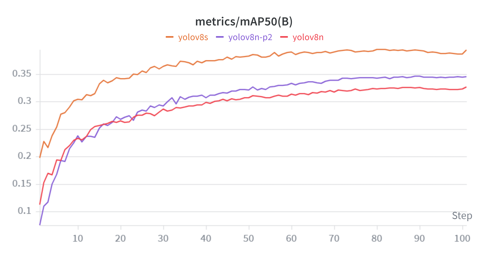
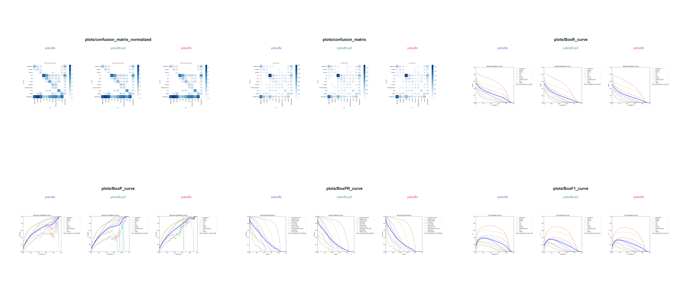
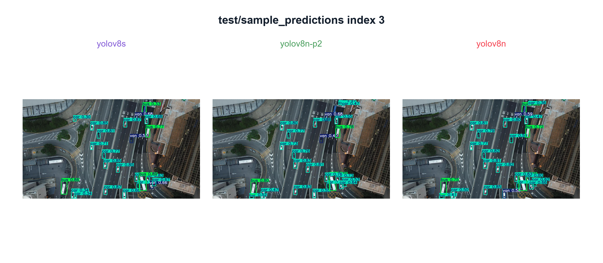

# Project 2: Real-Time Object Detection With VisDrone YOLOv8 (YOLOv8n, YOLOv8n-P2, YOLOv8s)

**Author:** Tran Tuan Minh - 20230051

This repository studies and deploys YOLOv8-based object detectors for traffic-scene object detection on the VisDrone dataset. It combines a reproducible fine-tuning workflow, W&B experiment tracking, quantitative benchmarking, and a local real-time web application for video inference, tracking, density visualization, and vehicle counting.

## Abstract

Small traffic objects in UAV and surveillance-like scenes are difficult for real-time detectors because of scale variation, occlusion, class imbalance, and dense object layouts. This project fine-tunes and evaluates three YOLOv8 variants on the 10-class VisDrone detection task:

| Model | Purpose |
| --- | --- |
| `yolov8n` | Lightweight YOLOv8 nano baseline |
| `yolov8n-p2` | Custom nano-scale model with an added P2 detection branch for smaller objects |
| `yolov8s` | Larger YOLOv8 small model for stronger accuracy |

The final system packages the trained checkpoints into a Flask-based local application that supports real-time visualization and offline export for report-quality analysis.

## Key Contributions

- Fine-tuned three YOLOv8 detector variants on VisDrone with W&B experiment tracking.
- Implemented a custom `yolov8n-p2` architecture by adding a P2 detection branch for small-object detection.
- Benchmarked validation and test-dev performance with mAP, precision, recall, per-class AP, and runtime metrics.
- Built a local real-time web application for video detection, ByteTrack-based tracking, density zones, vehicle counting, CSV logging, and annotated video export.
- Curated reproducible experiment summaries and visual panels under `experiments/` for analysis and reporting.

## Dataset

The experiments use the VisDrone detection classes:

```text
pedestrian, people, bicycle, car, van, truck, tricycle, awning-tricycle, bus, motor
```

Training and validation are performed through the Kaggle workflow in `kaggle/`. Final test benchmarking is logged to W&B project `test_log` and summarized in `experiments/summary/`.

## Methodology

The experimental pipeline is:

```text
VisDrone data
  -> YOLOv8 fine-tuning on Kaggle
  -> W&B logging for training, validation, and test-dev metrics
  -> local checkpoint placement under models/VisDrone/
  -> real-time Flask application and batch video export
  -> curated CSV/PNG summaries for reporting
```

The custom `yolov8n-p2` model is defined in `configs/models/yolov8n-p2.yaml`. It keeps nano-scale YOLOv8 settings and adds an extra P2-scale detection output to improve sensitivity to small objects.

## Results

### Fine-Tuning Validation Results

| Model | Precision | Recall | mAP50 | mAP50-95 | Params | GFLOPs |
| --- | ---: | ---: | ---: | ---: | ---: | ---: |
| `yolov8n` | 0.4566 | 0.3486 | 0.3259 | 0.1829 | 3.01M | 8.204 |
| `yolov8n-p2` | 0.4611 | 0.3695 | 0.3452 | 0.1974 | 2.93M | 12.378 |
| `yolov8s` | **0.5368** | **0.4006** | **0.3934** | **0.2288** | 11.14M | 28.666 |



### Test-Dev Benchmark

| Model | Precision | Recall | mAP50 | mAP50-95 | Total ms/image | Approx. FPS |
| --- | ---: | ---: | ---: | ---: | ---: | ---: |
| `yolov8n` | 0.4007 | 0.3092 | 0.2709 | 0.1506 | **6.734** | **148.50** |
| `yolov8n-p2` | 0.4074 | 0.3276 | 0.2855 | 0.1594 | 8.931 | 111.97 |
| `yolov8s` | **0.4506** | **0.3538** | **0.3202** | **0.1828** | 9.599 | 104.18 |

`yolov8s` obtains the strongest detection accuracy on both validation and test-dev. `yolov8n` is the fastest model, while `yolov8n-p2` provides a moderate accuracy improvement over `yolov8n` with extra compute from the P2 detection branch.



### Qualitative Comparison

The following panel compares predictions from the three final models on the same test image.



### Generalization Gap

| Model | Val mAP50 | Test mAP50 | Gap | Val mAP50-95 | Test mAP50-95 | Gap |
| --- | ---: | ---: | ---: | ---: | ---: | ---: |
| `yolov8n` | 0.3259 | 0.2709 | 0.0550 | 0.1829 | 0.1506 | 0.0322 |
| `yolov8n-p2` | 0.3452 | 0.2855 | 0.0597 | 0.1974 | 0.1594 | 0.0380 |
| `yolov8s` | 0.3934 | 0.3202 | 0.0732 | 0.2288 | 0.1828 | 0.0460 |

The larger `yolov8s` model achieves the best absolute accuracy, but it also shows a larger validation-to-test gap. This is expected when capacity increases on a difficult small-object dataset and should be considered when choosing a deployment model.

## Repository Layout

```text
app/
  realtime_front.py          Local Flask entry point
  detection.py               Batch object-detection export CLI

src/realtime_od/
  realtime_app.py            Flask routes and API
  realtime_template.py       Frontend HTML/CSS/JS template
  realtime_stream.py         Video reading, YOLO inference/tracking, MJPEG stream
  realtime_draw.py           Bounding boxes, tracks, density zones, counting line
  realtime_logger.py         Per-frame CSV logging
  detection_export.py        Batch annotated video and CSV export logic
  model_registry.py          Shared model registry for all local workflows

configs/
  project.yaml               Classes, models, inference defaults, Kaggle defaults
  models/yolov8n-p2.yaml     Custom YOLOv8n-P2 architecture

kaggle/
  train.py                   Kaggle fine-tuning script
  check_model.py             Model/config sanity checks

models/VisDrone/
  yolov8n/best.pt
  yolov8n-p2/best.pt
  yolov8s/best.pt

experiments/
  summary/                   Small CSV files for public analysis
  figures/                   Curated README/report figures
  comparison_panels/          W&B PNG panels for report writing

docs/                        Workflow and architecture documentation
scripts/                     Setup verification and W&B export utilities
```

## Installation

```powershell
conda activate real_time_od
pip install -r requirements.txt
python scripts/verify_setup.py
```

The verifier checks the project configuration, class list, model folders, and expected checkpoint paths.

## Run the Real-Time Application

```powershell
conda activate real_time_od
python app/realtime_front.py
```

Open:

```text
http://127.0.0.1:7860
```

The application supports:

```text
Object Detection      YOLOv8 bounding boxes, classes, confidences
Tracking              ByteTrack IDs and motion trails
Traffic Density       User-defined polygon zones
Vehicle Counting      User-defined counting line
CSV Logging           Per-frame detection logs under outputs/logs/
Stream Controls       Stream width and JPEG quality controls
```

## Batch Export

Export one annotated video:

```powershell
python app/detection.py `
  --source video/video2.mp4 `
  --model yolov8n-p2 `
  --device 0 `
  --conf 0.35 `
  --imgsz 640
```

Export every video in `video/`:

```powershell
python app/detection.py `
  --input-dir video `
  --output-root outputs/detection `
  --model yolov8n-p2 `
  --device 0
```

Each output folder contains:

```text
annotated.mp4
detections.csv
summary.json
sample.jpg
```

## Experiment Reproducibility

Training and W&B export instructions are documented in:

```text
docs/VISDRONE_RUN_GUIDE.md
docs/VISDRONE_TEST_BENCHMARK_GUIDE.md
docs/EXPERIMENTS_README.md
```

Useful scripts:

```powershell
python scripts/download_wandb_experiments.py
python scripts/generate_test_comparison_panels.py
```

The full raw W&B export is intentionally kept local and ignored by Git because it contains many generated media files. The public repository keeps only the compact artifacts needed to understand and reproduce the reported results:

```text
experiments/summary/*.csv
experiments/figures/*.png
experiments/comparison_panels/**/*.png
```

## Notes and Limitations

- The reported speed values are W&B benchmark measurements per image, not full browser-stream latency.
- The real-time app performance depends on GPU availability, input resolution, stream width, JPEG quality, and optional logging/tracking features.
- VisDrone remains challenging for very small and heavily occluded objects; per-class AP should be inspected before deploying to a class-specific scenario.
